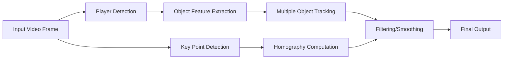

# Clarifai's PFF working repo
This repository contains all code related to the Clarifai / PFF partnership
for PFF's CV solution.

## Getting Started
1. This project uses `uv` and `make`, so make sure those are installed
1. We also make use of `git-lfs` for versioning of model files (e.g., pytorch files, onnx files, scikit-learn files)
   so you need to configure git-lfs
   1. e.g., `brew install git-lfs`
   1. `git lfs install`
1. `uv sync --dev` (add `--extra gpu` if on a GPU enabled machine)

## Structure
- `config/` - some useful configurations / hyper-parameter sets
- `deploy/` - anything deployment related (e.g., runner file trees)
- `scripts/` - some useful scripts for mot eval, tuning, plotting
- `src/clarifai_pff/` - source tree for the package, importable by runners due to `make` recipes
- `tests/` - directory for tests
- `Makefile` - Makefile for repeatable tasks (e.g., preflight local docker builds, deployments)

## System Overview
The CV solution consists of the following logical modules:
1. Player detection
1. Object feature extraction
1. Multiple Object Tracking
1. Key point detection (e.g., yard numbers, hash marks, yard lines)
1. Homography computation
1. Filtering / Smoothing through time

Graphically:

In practice, we use:
* A unified YOLOv7 model for the player, yard number, and hash mark detection tasks
* A specially trained embedder module
* Online tracking algorithm with ReID
* Line detection and homography are handled frame-by-frame via OpenCV (and extensions thereof)
* Filtering and Smoothing is applied to the homography outputs and tracks to
compensate for noisy measurements

## Training
### Object Detection
We use standard YOLOv7 training + RandomSnow augmentation.

### Embeddings
We leverage the provided player/ref data in the Clarifai platform and train
lightweight embeddings with `scripts/train_embedder.py`. At the time of writing, this is simply supervised contrastive learning within an image using
cosine embedding loss.

### ReID
ReID requires both detection output (with embeddings) and ground truth data so:

1. Generate data in protobuf format for ground truth and detection / embeddings in **_separate folders_**
   - This is done via `deploy/video-detect-track/example_inference.py` or running the ground truth boxes through the embedder and
   `scripts/label_studio_mot_json_to_pb.py`
   - We recommend using the detector's outputs as that is the target deployment pattern
1. `make reid DET_FOLDER=<> GT_FOLDER=<>`

## Evaluation
`python ./scripts/mot_eval.py --assoc_threshold $THR --include_classes players --tracker-config $DESIRED_TRACKER_CONFIG $GT_PB_DIR $DET_PB_DIR`

## Visualization
1. Extract video frames
1. `python src/clarifai_pff/auto_homography.py ...`
1. `python deploy/video-detect-track/example_inference.py ...`
1. `python scripts/plot_mot.py $DETECTOR_OUTPUT_PB $AUTO_HOMOGRAPHY_OUTPUT_DIR/homography $AUTO_HOMOGRAPHY_OUTPUT_DIR/frames --tracker_config $DESIRED_TRACKER_CONFIG --camera_correction [--smooth]`